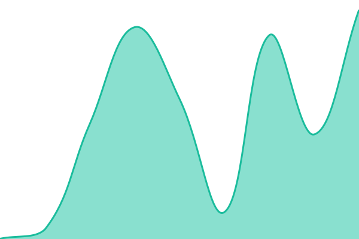
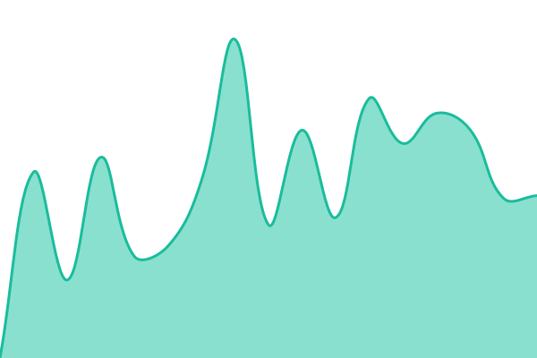

# [📈 Live Status](https://status.blinker-app.com): <!--live status--> **🟩 All systems operational**

This repository contains the open-source uptime monitor and status page for [Fabio Ferrero](fabio.ff90@gmail.com), powered by [Upptime](https://github.com/upptime/upptime).

With [Upptime](https://upptime.js.org), you can get your own unlimited and free uptime monitor and status page, powered entirely by a GitHub repository. We use [Issues](https://github.com/fabioferrero90/blinker-status/issues) as incident reports, [Actions](https://github.com/fabioferrero90/blinker-status/actions) as uptime monitors, and [Pages](https://status.blinker-app.com) for the status page.

<!--start: status pages-->
<!-- This summary is generated by Upptime (https://github.com/upptime/upptime) -->
<!-- Do not edit this manually, your changes will be overwritten -->
<!-- prettier-ignore -->
| URL | Status | History | Response Time | Uptime |
| --- | ------ | ------- | ------------- | ------ |
|  [Blinker App (sito)](https://blinker-app.com) | 🟩 Up | [blinker-app-sito.yml](https://github.com/fabioferrero90/blinker-status/commits/HEAD/history/blinker-app-sito.yml) | 

 546ms
     
 | 

<a href="https://status.blinker-app.com/history/blinker-app-sito">100.00%</a>
    

|  [Supabase Auth API](https://jentlukmtglyfghtozvs.supabase.co/auth/v1/health) | 🟩 Up | [supabase-auth-api.yml](https://github.com/fabioferrero90/blinker-status/commits/HEAD/history/supabase-auth-api.yml) | 

 209ms
     
 | 

<a href="https://status.blinker-app.com/history/supabase-auth-api">100.00%</a>
    

|  [Blinker Health Check](https://jentlukmtglyfghtozvs.supabase.co/functions/v1/health-check) | 🟩 Up | [blinker-health-check.yml](https://github.com/fabioferrero90/blinker-status/commits/HEAD/history/blinker-health-check.yml) | 

 516ms
     
 | 

<a href="https://status.blinker-app.com/history/blinker-health-check">100.00%</a>
    

<!--end: status pages-->

[**Visit our status website →**](https://status.blinker-app.com)

## 📄 License

- Powered by: [Upptime](https://github.com/upptime/upptime)
- Code: [MIT](./LICENSE) © [Anand Chowdhary](https://anandchowdhary.com)
- Data in the `./history` directory: [Open Database License](https://opendatacommons.org/licenses/odbl/1-0/)
